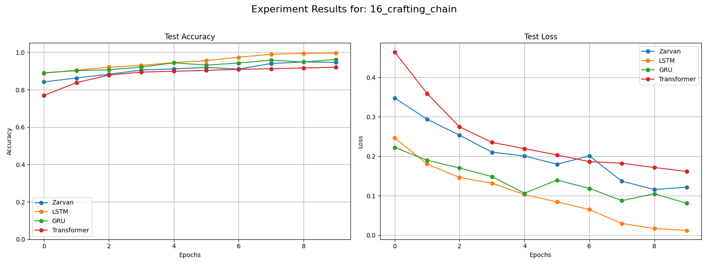

# Zarvan v2: A Hybrid MoE Architecture for Advanced Sequence Modeling

This repository contains the official PyTorch implementation and experimental results for **Zarvan v2**, a novel neural network architecture designed for efficient and powerful sequence modeling.

Zarvan v2 is a hybrid Mixture-of-Experts (MoE) model that combines parallel, stateless context extractors with a deterministic state machine, the `_SequentialExtractor`. This design allows it to achieve linear-time complexity `O(S)` while excelling at complex reasoning tasks that require long-term memory and stateful processing.

---

## Key Features

- **Linear Complexity**: Scales efficiently to long sequences, overcoming the `O(S^2)` bottleneck of standard Transformers.
- **Hybrid MoE Framework**: Dynamically chooses between three specialized experts:
    1.  **Holistic Extractor**: Captures the overall "gist" of a sequence.
    2.  **Associative Extractor**: Focuses on sparse, salient information for focused memory.
    3.  **Sequential Extractor**: A deterministic state machine with perfect, non-decaying memory for stateful, path-dependent reasoning.
- **State-of-the-Art Performance**: Outperforms standard Transformers on complex reasoning tasks and LSTMs on long-range memory benchmarks.
- **Versatility**: Achieves highly competitive results across multiple domains, including reasoning, vision (MNIST, CIFAR-10), and audio (Google Speech Commands).

---

## Repository Structure

This repository is organized into experiment scripts and their corresponding result logs.

### Experiment Scripts

The Python scripts (`.py` files) contain the complete code for reproducing the experiments. Each script is self-contained and includes model definitions, data loaders, and the training/evaluation framework.

- `reasoning_*.py`: Scripts for the various synthetic reasoning and SSM-like tasks.
- `minst_vision.py`: The experiment script for the MNIST vision-as-sequence task.
- `cifar-10_vision.py`: The experiment script for the more challenging CIFAR-10 vision task.
- `speech-audio.py`: The experiment script for the audio classification task on the Google Speech Commands dataset.

### Results

The text files (`.txt` files) contain the raw console logs for each experiment, detailing the training and evaluation progress for every model across all epochs.

---

## Running the Experiments

Each experiment script is designed to be run directly.

1.  **Clone the repository:**
    ```bash
    git clone [https://github.com/systbs/zarvan-v2.git](https://github.com/systbs/zarvan-v2.git)
    cd zarvan-v2
    ```

2.  **Install dependencies:**
    ```bash
    pip install torch torchvision torchaudio tqdm numpy matplotlib
    ```

3.  **Choose and run an experiment:**
    Open any of the Python scripts (e.g., `reasoning_5.py`). Navigate to the `if __name__ == '__main__':` block at the end of the file. You can select which task to run by changing the `task_to_run` variable.

    ```python
    # Example from reasoning_5.py
    if __name__ == '__main__':
        # ... config ...
        all_tasks = {
            "18_selective_copying": SelectiveCopyingDataset,
            "19_signal_accumulation": SignalAccumulationDataset,
            "20_dominant_frequency": DominantFrequencyDataset,
        }

        # CHOOSE YOUR SSM-LIKE EXPERIMENT HERE
        task_to_run = "18_selective_copying"
        
        # ... run experiment ...
    ```
    Then, simply run the script from your terminal:
    ```bash
    python reasoning_5.py
    ```
---

## Key Results Summary

Zarvan v2 was benchmarked against standard Transformer, LSTM, and GRU models. On vision and audio tasks, it was also compared to specialized architectures (CNNs, ViT/AST).

| Domain | Task | Zarvan v2 Accuracy | Best Baseline Accuracy | Notes |
| :--- | :--- | :---: | :---: | :--- |
| **Reasoning**| Dynamic Pathfinding | **99.10%** | 97.32% (GRU) | Transformer fails completely (39.50%). |
| **Memory** | Selective Copying | **99.69%** | 100.0% (GRU) | LSTM fails catastrophically (9.91%). |
| **Vision** | CIFAR-10 | 65.18% | **83.54% (CNN)** | Shows limitation of sequential processing on complex spatial data. |
| **Audio** | Speech Commands | **80.71%** | 85.69% (1D CNN) | Zarvan was the *best* model on spectrogram input, outperforming AST and 2D CNN. |

These results demonstrate that Zarvan v2 is a state-of-the-art architecture for tasks requiring deep stateful memory and reasoning, while remaining a versatile and competitive model for general-purpose sequence processing.

## Result Visualizations

This section provides a complete gallery of the training and evaluation charts for all experiments conducted.

### Foundational Reasoning Tasks (1-8)

| 1. Binary Flip | 2. Ternary Cycle | 3. Parallel States |
| :---: | :---: | :---: |
|  |  |  |
| **4. Long Dependency** | **5. Reasoning in Noise** | **6. Conditional Logic** |
|  |  |  |
| **7. Hierarchical Reasoning** | **8. Counting** | |
|  |  | |

### Advanced & Algorithmic Tasks (9-17)

| 9. Relational Induction | 10. Stack Algorithm | 11. Delayed Execution |
| :---: | :---: | :---: |
|  |  |  |
| **12. Compositional Math** | **13. Combination Lock** | **14. Conditional Resource** |
|  |  |  |
| **15. 1D Dynamic Pathfinding** | **16. Crafting Chain** | **17. 2D Dynamic Pathfinding** |
|  |  |  |

### State-Maintaining (SSM-like) Tasks (18-20)

| 18. Selective Copying | 19. Signal Accumulation | 20. Dominant Frequency |
| :---: | :---: | :---: |
|  |  |  |

### Vision & Audio Benchmarks

| MNIST Classification | CIFAR-10 Classification | Speech Commands |
| :---: | :---: | :---: |
|  |  |  |

---

## Contact

Yasser Sajjadi  
yassersajjadi@gmail.com
